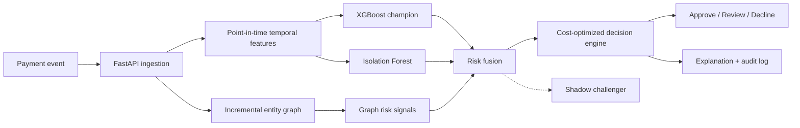
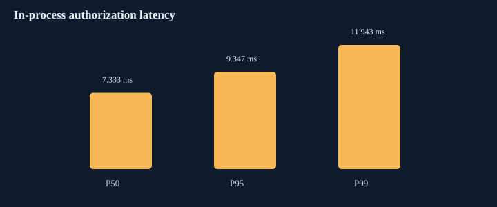
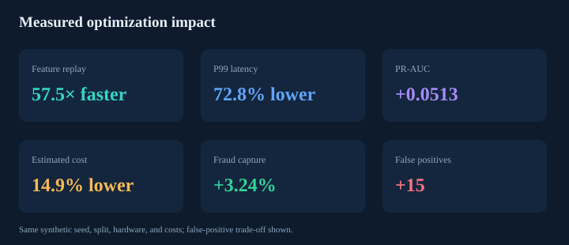

# Aegis Fraud Decision Engine

[](https://github.com/sfeirc/FRAUD-DECISION-ENGINE/actions/workflows/ci.yml)
[](https://www.python.org/)
[](LICENSE)

Aegis makes auditable approve/review/decline payment decisions by fusing temporal,
XGBoost, anomaly, and entity-graph risk under explicit business costs.

## Demo: a fraud ring emerges while traffic is live

```bash
python -m pip install -e ".[dev]"
make demo
# or: docker compose up, then open http://localhost:8000/dashboard
```

The deterministic demo sends ordinary payments through the authorization service, injects
a coordinated ring sharing a device and IP, exports its graph, explains each decision, and
raises false-positive costs to re-optimize both decision thresholds. In the checked run,
mean risk moved from `0.09581` for normal traffic to `0.77182` for the ring; review/decline
thresholds moved from `0.284/0.572` to `0.716/0.740`. These are simulator observations,
not estimates of live fraud performance.

The dashboard shows the authorization stream, champion and shadow scores, explanations,
latency, the review queue, graph ring, and interactive cost controls.

## Architecture



The offline replay uses the same feature and graph transition code as online inference.
The current event is scored before it mutates either state store. Simulated fraud labels
enter graph statistics only after a configurable confirmation delay.

## Measured reference results

Reference: commit `7cd199f`, seed 7, 2,225 simulated payments, chronological split of
1,446 train / 334 validation / 445 test rows on Windows 11, Python 3.12.13, an 8-logical-CPU
Intel64 host. Thresholds were optimized on validation data and evaluated once on test data.

| Held-out metric | Champion | Shadow challenger |
|---|---:|---:|
| PR-AUC | 0.7163 | 0.7166 |
| ROC-AUC | 0.8839 | 0.8869 |
| Precision | 0.5833 | 0.5870 |
| Recall | 0.7368 | 0.7105 |
| Recall at 1% FPR | 0.5526 | 0.5526 |
| Fraud amount captured | 84.05% | 84.05% |
| Estimated total cost | 2,095.35 | 2,233.93 |

Champion decisions produced 20 false positives and 19 manual reviews. Sequential warm-model
in-process latency was p50 `7.67 ms`, p95 `11.50 ms`, and p99 `13.22 ms`; it includes
features, graph updates, both models, TreeSHAP contributions, and audit serialization, but
excludes HTTP and network transport. “Fraud captured” and costs use simulated labels and
configured assumptions; they are not realized financial savings.




## Measured optimization impact



| Same-seed comparison | Baseline | Optimized | Change |
|---|---:|---:|---:|
| Feature replay | 7.981 s | 0.114 s | 69.9× faster |
| P99 decision latency | 43.92 ms | 13.22 ms | 69.9% lower |
| PR-AUC | 0.6650 | 0.7163 | +0.0513 |
| Fraud amount captured | 80.82% | 84.05% | +3.24 pp |
| Estimated total cost | 2,461.21 | 2,095.35 | 14.9% lower |
| False positives | 5 | 20 | +15 |

The graph speedup replaces repeated full connected-component traversals with an incremental
union-find index carrying component size and delayed fraud aggregates. Latency also benefits
from skipping unused TreeSHAP work for the non-decisional challenger. Quality gains come from
validation-selected model/fusion settings and additional authorization-time features. The
false-positive increase is the explicit cost-optimized trade-off for higher recall and fraud
capture under the stated assumptions.

[Optimized raw rows](benchmarks/results/optimized/raw_measurements.csv) ·
[optimized run metadata](benchmarks/results/optimized/summary.json) ·
[baseline run](benchmarks/results/reference/summary.json) ·
[machine-readable comparison](benchmarks/results/comparison/comparison.json) ·
[benchmark method](docs/benchmarking.md)

## Why this is difficult

- A useful classifier score is not yet a rational payment decision. Review capacity,
  customer harm, transaction value, and expected fraud loss change the action boundary.
- Velocity and graph features are stateful. One out-of-order update or premature label can
  make an offline result impossible to reproduce online.
- Fraud is adversarial and rare. ROC-AUC and accuracy can look healthy while the review
  queue is unusable, so the benchmark includes PR-AUC, fixed-FPR recall, amount capture,
  false positives, reviews, cost, and tail latency.
- A challenger must execute the same event path without changing customer outcomes.

## Quick start

Python 3.12+ is required.

```bash
python -m pip install -e ".[dev]"
make demo       # finite, deterministic CLI scenario and JSON artifact
make run        # API and dashboard on http://localhost:8000
```

Authorize a payment:

```bash
curl -X POST http://localhost:8000/v1/payments/authorize \
  -H "Content-Type: application/json" \
  -d '{"customer_id":"cus_1","card_id":"card_1","merchant_id":"mer_1","amount":185.20,"currency":"EUR","country":"FR","ip_address":"10.1.2.3","device_id":"dev_9","merchant_category":"electronics","authentication_method":"3ds","authentication_successful":true,"latitude":48.8566,"longitude":2.3522}'
```

Every response includes the decision, fused score, model version, reason codes, native
XGBoost contribution values, rules, graph signals, timestamp, trace ID, latency, and the
challenger's non-decisional result. OpenAPI is at `/docs`.

## Implementation details

- `PaymentSimulator` creates customers, cards, merchants, devices, IPs, countries,
  currencies, authentication methods, and nine configurable attack families. Benign
  traffic also includes travel, new devices, shared NAT IPs, and amount spikes.
- `OnlineFeatureStore` owns one-minute/hour/day counts, spend velocity, amount baseline,
  geography, device/merchant novelty, authentication context, inter-arrival time, and
  failed-auth frequency.
- `FraudGraph` incrementally connects customer ↔ card/device/IP/merchant and derives shared
  entity counts, component size, degree, merchant concentration, and delayed neighborhood
  fraud statistics. A disjoint-set index keeps component queries near-constant amortized time;
  NetworkX remains the investigator-facing visualization graph.
- `RiskModel` fuses XGBoost, Isolation Forest, and graph risk. Deep learning was excluded:
  this dataset does not demonstrate that its operational cost would buy material value.
- `DecisionEngine` grid-searches review and decline thresholds against decomposed costs.
  Champion and challenger run together, while only champion output reaches decisioning.

See [architecture](docs/architecture.md), [feature contract](docs/features.md), and
[fraud scenarios](docs/fraud-scenarios.md).

## Tests and checks

```bash
make check      # Ruff, mypy, pytest, package build
make audit      # installed dependency vulnerability audit
```

Tests cover window boundaries, point-in-time leakage, delayed graph feedback, ring signals,
cost threshold behavior, deterministic model output, malformed requests, API label
rejection, shadow output, and a 250 ms local latency guardrail. CI repeats formatting,
linting, tests with coverage, build, and dependency audit on every push and pull request.

## Reproduce the benchmark

```bash
make benchmark
# custom size/seed/output:
python -m fraud_engine.benchmark --normal-events 2000 --seed 7 \
  --output-dir benchmarks/results/my-run
python -m fraud_engine.compare benchmarks/results/reference/summary.json \
  benchmarks/results/my-run/summary.json
```

Each run writes raw CSV rows, JSON environment/configuration metadata, and SVG figures.
Results are deterministic at the data/model level for a fixed dependency set; wall-clock
latency is expected to vary by host load and hardware.

## Engineering decisions

Architecture Decision Records live in [`docs/adr`](docs/adr):

- [ADR 001: in-process state for a reproducible reference](docs/adr/001-in-process-state.md)
- [ADR 002: point-in-time event replay](docs/adr/002-point-in-time-features.md)
- [ADR 003: hybrid models instead of graph deep learning](docs/adr/003-hybrid-risk-model.md)
- [ADR 004: cost thresholds and shadow challenger](docs/adr/004-cost-decisioning-and-shadow.md)
- [ADR 005: incremental graph component index](docs/adr/005-incremental-graph-index.md)
- [ADR 006: shared anomaly scoring](docs/adr/006-shared-anomaly-scoring.md)

## Known limitations

This is an executable reference system, not a claim of production readiness. State is
process-local and is neither durable nor horizontally consistent; there is no Kafka/Flink,
Redis feature store, model registry, authentication, encryption/key management, review-case
workflow, drift alerting, or chargeback ingestion. Labels and economics are simulated. The
benchmark is one seed on one workstation and does not establish live precision, capacity,
or financial impact. See the full [limitations](docs/limitations.md).

## Future work

1. Replace in-memory state with event-log-backed, idempotent stream processing and an online
   store while retaining the point-in-time contract tests.
2. Add delayed chargeback ingestion, calibration/drift monitoring, review capacity limits,
   and champion promotion gates over multiple time windows and seeds.
3. Benchmark concurrent HTTP traffic, process restarts, skewed hot keys, late events, and
   graph partitioning before making a scale or SLO claim.

The [technical report](docs/technical-report.md) covers modeling and business reasoning;
[the performance report](docs/performance-report.md) documents profiling and optimization;
[interview notes](docs/interview-materials.md) contain talking points, CV bullets, a LinkedIn
description, and 30-second/2-minute pitches.
