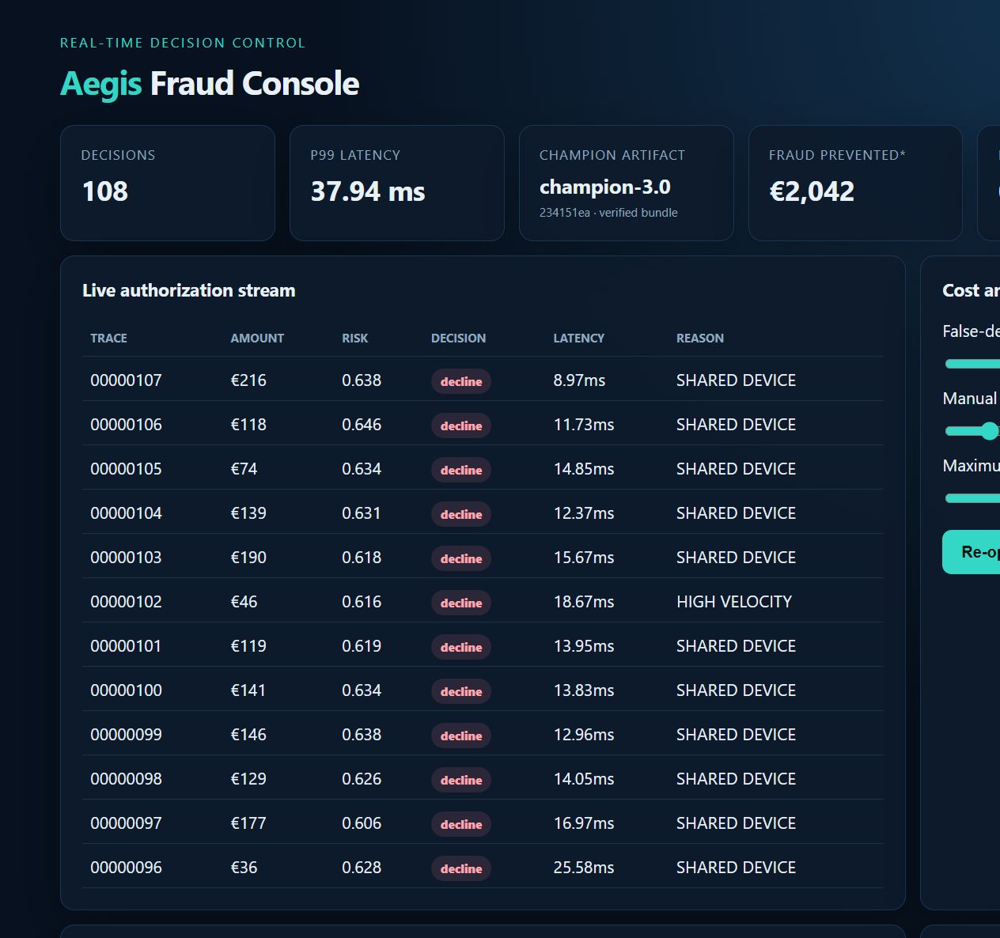
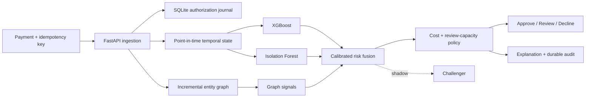
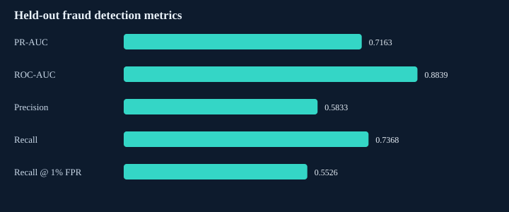
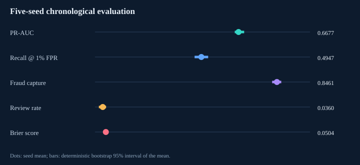
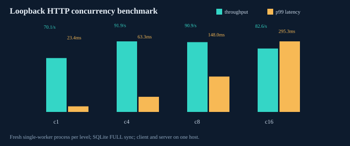

# Aegis Fraud Decision Engine

[](https://github.com/sfeirc/FRAUD-DECISION-ENGINE/actions/workflows/ci.yml)
[](https://www.python.org/)
[](LICENSE)

Aegis makes auditable approve/review/decline payment decisions by combining point-in-time
behavior, supervised and anomaly models, entity-graph risk, calibrated probabilities, and
explicit fraud/customer/review costs.

## Why this matters across industries

Auditable, cost-aware decisioning that combines supervised models, anomaly detection, and entity-graph risk is core to payments/banking fraud teams, but the same architecture — calibrated probabilities plus an explicit cost model rather than a raw score threshold, and a decision that can be explained after the fact — is exactly what any regulated or high-stakes automated-decision system needs: insurance claims triage, industrial safety-incident flagging, or a consulting engagement building defensible decision automation for a client. The entity-graph ring-detection angle also generalizes directly to any anomaly-detection problem where the interesting signal is in how entities relate to each other, not just their individual features.

## Demo: watch a coordinated ring emerge

```bash
python -m pip install -e ".[dev]"
make demo
# or: docker compose up, then open http://localhost:8000/dashboard
```

The finite demo first authorizes 90 ordinary payments, then injects 18 fraud-ring payments
that reuse a device and IP. In the checked run, mean score moved from `0.05296` to `0.57144`;
16 ring payments were declined and configured simulated prevented value was `€2,041.97`.
Raising false-positive costs moved review/decline thresholds from `0.116/0.212` to
`0.476/0.500`. These are deterministic simulator observations, not live fraud estimates.

The live console streams decisions, explanations, champion/shadow scores, the connected fraud
ring, durable review counts, artifact provenance, latency, and interactive cost/capacity
policy controls.



## Architecture



The current payment is scored before it mutates temporal or graph state. Offline replay calls
the same transitions. Simulated fraud feedback enters graph statistics only after a delay.
Exact transaction retries return the journaled response; conflicting reuse and events beyond
the five-minute lateness policy return HTTP 409.

## Measured results

### Held-out seed-7 result

Commit `234151e`, 2,225 simulated payments, chronological 1,446/334/445
train/validation/test split, Windows 11, Python 3.12.13. Models fit on train; Platt
calibration and cost/capacity thresholds fit on validation; test is reported once.

| Test metric | Champion 3.0 | Shadow 3.1 |
|---|---:|---:|
| PR-AUC | 0.7163 | 0.7166 |
| ROC-AUC (reference) | 0.8839 | 0.8869 |
| Precision / recall | 0.5833 / 0.7368 | 0.5833 / 0.7368 |
| Recall at 1% FPR | 0.5526 | 0.5526 |
| Brier score | 0.0455 | 0.0449 |
| Fraud amount captured | 84.60% | 84.60% |
| False positives / reviews | 20 / 11 | 20 / 12 |
| Configured estimated cost | 2,238.39 | 2,215.39 |

Calibration does not change rank metrics. Relative to the v0.2 seed-7 policy, v0.3 captured
0.55 percentage points more fraud and reduced reviews from 19 to 11, but estimated cost rose
6.8% (`2,095.35 → 2,238.39`). The capacity/calibration change is therefore a control-plane
improvement, not a claimed economic optimization.



### Five-seed robustness result

Each seed independently regenerates data, fits models, calibrates scores, selects thresholds,
and evaluates its chronological holdout. The interval is a deterministic 10,000-resample
bootstrap across five simulator seeds; it describes simulator-seed variation only.

| Metric | Mean | Bootstrap 95% interval | Seed range |
|---|---:|---:|---:|
| PR-AUC | 0.6677 | 0.6501–0.6937 | 0.6419–0.7163 |
| Recall at 1% FPR | 0.4947 | 0.4632–0.5263 | 0.4474–0.5526 |
| Fraud amount captured | 84.61% | 82.39%–86.62% | 80.92%–87.48% |
| False positives | 29.2 | 11.6–48.8 | 2–60 |
| Review rate | 3.60% | 1.80%–5.17% | 0.45%–5.62% |
| Brier score | 0.0504 | 0.0477–0.0526 | 0.0455–0.0538 |

The 5% validation review constraint exceeded 5% on two unseen seeds. That is measured policy
drift and evidence that a real system needs runtime queue enforcement and monitoring.



### Full HTTP concurrency result

Commit `d770d2a`, one Uvicorn worker, fresh SQLite database per level, WAL + `FULL` sync,
25 excluded warmups and 500 measured requests at each concurrency. Client and server ran on
the same Windows host over loopback. The measurement includes HTTP/JSON, scheduling,
features, graph mutation, champion/challenger inference, explanation, and journal write.

| Concurrency | Throughput | Client p50 | Client p95 | Client p99 | Errors |
|---:|---:|---:|---:|---:|---:|
| 1 | 70.1 req/s | 13.29 ms | 19.45 ms | 23.44 ms | 0/500 |
| 4 | 91.9 req/s | 41.55 ms | 55.12 ms | 63.25 ms | 0/500 |
| 8 | 90.9 req/s | 83.75 ms | 102.02 ms | 147.98 ms | 0/500 |
| 16 | 82.6 req/s | 180.92 ms | 259.01 ms | 295.34 ms | 0/500 |

Throughput saturates near concurrency 4 because the service deliberately serializes state
mutation. This is a measured limitation, not a scale result or SLO.



[Seed-7 raw rows](benchmarks/results/v0.3/raw_measurements.csv) ·
[five-seed raw results](benchmarks/results/robustness/per_seed.csv) ·
[HTTP raw requests](benchmarks/results/http-load/raw_requests.csv) ·
[benchmark protocol](docs/benchmarking.md)

## Why this is difficult

- Stateful velocity and graph features must be identical online and offline without reading
  the current event or future chargebacks.
- A useful ranking score is not a business decision. Fraud value, customer harm, review
  staffing, calibration, and operating cost all change the correct action.
- Payment retries, out-of-order events, shadow execution, and model provenance are correctness
  problems, not model-metric details.
- Fraud is rare and adversarial. Accuracy and even ROC-AUC can look strong while precision,
  fixed-FPR recall, queue volume, or financial cost are unacceptable.
- A shared entity graph exposes coordinated infrastructure but creates ordering, hot-key,
  memory, and partitioning challenges.

## Quick start

Python 3.12+ is required.

```bash
python -m pip install -e ".[dev]"
make demo                 # finite deterministic scenario + JSON evidence
make run                  # API/dashboard: http://localhost:8000
docker compose up --build # API + persistent SQLite volume
```

```bash
curl -X POST http://localhost:8000/v1/payments/authorize \
  -H "Content-Type: application/json" \
  -d '{"transaction_id":"order-42","trace_id":"trace-42","customer_id":"cus_1","card_id":"card_1","merchant_id":"mer_1","amount":185.20,"currency":"EUR","country":"FR","ip_address":"10.1.2.3","device_id":"dev_9","merchant_category":"electronics","authentication_method":"3ds","authentication_successful":true,"latitude":48.8566,"longitude":2.3522}'
```

Responses contain the action, calibrated risk, champion artifact version, native XGBoost
contributions, rules, graph signals, timestamp, trace ID, in-process latency, and the
challenger's non-decisional prediction. OpenAPI is at `/docs`; Prometheus text is at
`/metrics`.

## Implementation details

- `PaymentSimulator`: customers, cards, merchants, amounts, currencies, countries, IPs,
  devices, categories, authentication, realistic benign variation, and nine configurable
  attack families.
- `OnlineFeatureStore`: minute/hour/day counts, spend velocity, amount baseline, geography,
  novelty, failed authentication, inter-arrival time, and read-before-write state.
- `FraudGraph`: customer ↔ card/device/IP/merchant edges, shared infrastructure, component
  size, degree, merchant concentration, delayed neighbor fraud, and an indexed union-find
  path for near-constant amortized component queries.
- `RiskModel`: XGBoost + Isolation Forest + graph fusion, per-version Platt calibration, and
  native TreeSHAP-style XGBoost contribution values. No deep learning was added without an
  experiment showing incremental value.
- `DecisionEngine`: ordered threshold search over decomposed business cost with a validation
  review-rate constraint. The model ranks risk; policy owns customer action.
- `AuthorizationStore`: SQLite WAL/full-sync response journal, exact retry semantics,
  request-hash conflicts, customer watermarks, and persistent audit queries.
- `artifacts/models/v0.3.0`: checksum-verified champion, challenger, validation data, policy,
  ordered feature contract, environment, and source commit. API startup never retrains.

## Tests and CI

```bash
make check  # Ruff formatting/lint, strict mypy, pytest + coverage, package build
make audit  # installed dependency vulnerability audit
```

The current suite has 35 tests and measured 85.62% line coverage locally. It covers temporal
boundaries, leakage, delayed labels, graph-index equivalence, threshold/capacity behavior,
calibration, deterministic models, artifact tampering, idempotent retries, persistence,
late events, malformed requests, shadow output, and a real-server HTTP benchmark smoke run.
GitHub Actions repeats formatting, linting, strict typing, tests, build, dependency audit,
and CodeQL analysis; Dependabot monitors Python and workflow dependencies.

## Reproduce every benchmark

```bash
make artifacts       # explicit retraining; API startup only loads
make benchmark       # seed-7 quality + in-process latency
make robustness      # five independent chronological evaluations
make load-benchmark  # 4 HTTP concurrency levels, 2,000 measured requests
```

Every checked benchmark saves commit, hardware, OS, software, configuration, raw CSV, JSON
summary, and generated SVG. Wall-clock results vary with host load; simulator evidence does
not predict a live issuer population.

## Engineering decisions

Ten ADRs in [`docs/adr`](docs/adr) record alternatives, benefits, drawbacks, and consequences.
The newest cover [versioned model artifacts](docs/adr/007-versioned-model-artifacts.md),
[calibration/review capacity](docs/adr/008-calibration-and-review-capacity.md),
[durable idempotency](docs/adr/009-durable-idempotency-journal.md), and
[HTTP load methodology](docs/adr/010-http-load-method.md).

## Known limitations

This is an executable reference, not a production-readiness claim. Temporal/graph state is
still process-local and is not reconstructed from the journal. SQLite is a single-writer
choice. There is no Kafka/Flink, distributed feature store, runtime hard review quota,
chargeback ingestion, PII tokenization, authentication, model approval service, drift alert,
fairness analysis, case-management workflow, TLS benchmark, or failure-injected multi-node
test. Synthetic labels and configured costs do not establish real precision or savings.
See [all limitations](docs/limitations.md).

## Future work

1. Couple event-log offsets, feature/graph updates, and decisions transactionally; checkpoint
   and replay state, then test crashes, duplicates, late events, and hot keys.
2. Add rolling calibration/drift monitors and a hard time-bucketed review budget with
   segment diagnostics and delayed outcome ingestion.
3. Add explicit challenger promotion/rollback gates across time windows, seeds, calibration,
   economic deltas, latency, and fairness—not only ranking metrics.
4. Repeat sustained remote/TLS/container load tests before changing the single-worker design
   or making any capacity claim.

The [technical report](docs/technical-report.md), [performance report](docs/performance-report.md),
and [interview pack](docs/interview-materials.md) explain the design and evidence in depth.
