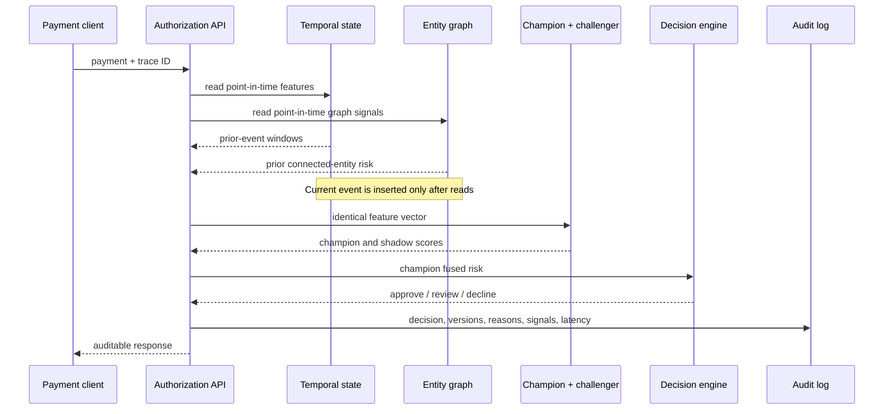

# Architecture

## Runtime path

The application intentionally keeps the reference deployment in one process. This makes
state transitions and benchmarks reproducible without pretending to solve distributed
ordering. ADR 001 describes what must change for a multi-instance deployment.

## Components

| Component | Responsibility | State |
|---|---|---|
| FastAPI | Validate authorization payloads and expose dashboard/control APIs | None |
| OnlineFeatureStore | Customer temporal windows and historical aggregates | In memory |
| FraudGraph | Entity edges, structural features, confirmed-fraud counters | In memory |
| RiskModel | XGBoost, Isolation Forest, fusion, native TreeSHAP values | Fitted objects |
| DecisionEngine | Threshold optimization and action selection | Costs + thresholds |
| Audit log | Traceable response records and dashboard feed | Bounded in memory |
| Benchmark | Point-in-time replay, metrics, latency, metadata, figures | Files |

## Consistency boundary

`FraudDecisionService.authorize` serializes state mutation with a re-entrant lock. This
ensures each process has deterministic read-before-write semantics. It also limits local
concurrency and is explicitly not evidence of distributed correctness or capacity.

## Feedback path

Authorization requests never contain labels. Offline replay queues simulated confirmed fraud
and releases it into graph statistics only after the configured delay. A real deployment
would replace that queue with an idempotent chargeback/analyst-outcome stream.

