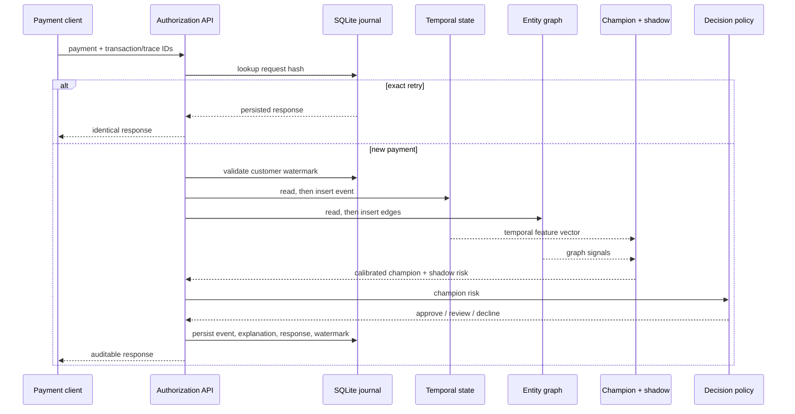
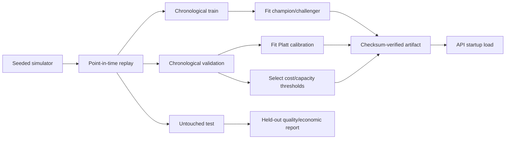

# Architecture

## Runtime path

## Components and state

| Component | Responsibility | State / persistence |
|---|---|---|
| FastAPI | Validate requests and expose control, audit, graph, health, metrics | Stateless routing |
| OnlineFeatureStore | Temporal windows and historical aggregates | In memory |
| FraudGraph | Heterogeneous edges and indexed component aggregates | In memory |
| RiskModel | XGBoost, Isolation Forest, graph fusion, Platt calibration, explanations | Checked bundle |
| DecisionEngine | Cost/capacity threshold selection and action | Checked bundle + interactive updates |
| AuthorizationStore | Idempotency, watermarks, response/audit journal | SQLite WAL/full-sync |
| Load/quality suites | Raw measurements, metadata, summaries, generated plots | Versioned files |

## Consistency boundary

`FraudDecisionService.authorize` serializes lookup, read-before-write feature/graph mutation,
model inference, decision, and journal save with a re-entrant lock. This gives deterministic
ordering inside one process and causes the measured concurrency plateau. Health/metrics reads
are observational and are not a distributed snapshot.

The journal survives restart, but temporal/graph state does not. Exact retries remain stable;
new post-restart decisions begin from empty behavioral state. This is intentionally disclosed
as a partial durability boundary, not exactly-once processing.

## Offline and model lifecycle

Fraud labels are absent from authorization requests. Offline replay releases simulated fraud
into graph statistics only after the confirmation delay. Promotion is manual: shadow scoring
is implemented, but no automatic registry approval or rollback is claimed.

## Distributed successor boundary

A multi-instance design must replace the process lock with partitioned event ordering, store
temporal/graph state durably, atomically couple input offset/state/decision, recover from
checkpoints, bound graph memory, handle late-event correction, and preserve the point-in-time
contract. Merely adding Kafka would not establish those guarantees.
